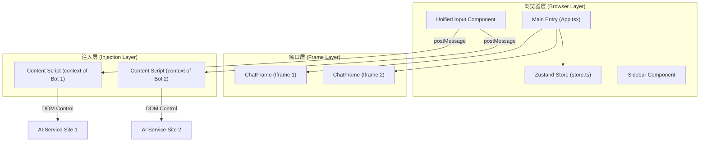

# Chrome ChatHub - 系统详细设计说明书

**版本**: 1.1.0  
**更新日期**: 2026-02-09  
**项目名称**: Chrome ChatHub (多 AI 对话聚合器)

---

## 1. 技术栈与架构概览

### 1.1 技术栈
- **前端框架**: React 19 + TypeScript
- **状态管理**: Zustand
- **样式方案**: Tailwind CSS (核心: 极简主义, Apple 风格 UI)
- **拖拽库**: @dnd-kit/core, @dnd-kit/sortable (新增)
- **图标库**: Lucide React
- **扩展规范**: Chrome Extension Manifest V3
- **构建工具**: Vite + CRXJS (Vite 插件)

### 1.2 系统架构图


---

## 2. 核心模块设计

### 2.1 主应用 (App.tsx)
负责整体布局管理容器。
- **Grid Layout**: 动态计算列数, 支持 `1x1` (单屏), `2x1` (分屏), `Grid` (多屏) 布局。
- **Overlay**: 处理全屏/聚焦模式 (Focus mode) 的遮罩逻辑。

### 2.2 状态管理 (store.ts)
使用 Zustand 实现轻量级持久化状态管理。
- **Persistence**: 与 `chrome.storage.local` 同步。
- **Actions**: 
    - `loadActiveBots()`: 从存储加载当前激活的 AI 实例。
    - `toggleBot()`: 切换 AI 服务挂载状态。
    - `toggleBot()`: 切换 AI 服务挂载状态。
    - `reloadAllBots()`: 用于清空当前所有会话环境。
    - `reorderBots()`: 处理拖拽后的数组重排逻辑。
    - `saveActiveBots()`: 持久化当前用户的选择。

### 2.3 消息广播系统 (lib/broadcast.ts)
封装了 `postMessage` 通信逻辑。
- **机制**: 遍历页面上所有的 `iframe`, 通过 `contentWindow.postMessage` 发送统一指令。
- **安全**: 通信包含唯一的 `HubMessage` 类型验证。

### 2.4 注入脚本 (content/index.ts)
这是系统的"大脑", 运行在每个 AI 服务的页面上下文中。
- **Lifecycle**: 
    1. 页面加载时检测当前 HOST。
    2. 加载对应的 `ServiceAdapter` 配置。
    3. 监听来自 Hub 的 `USER_MESSAGE` 指令。
- **Native Value Setter**: 绕过 React/Vue 等框架的内部状态校验, 直接操作底层 DOM 的 `value` 属性原型。
- **Event Simulation**: 精确模拟 `Input`, `Change` 以及 `KeyboardEvent` (Enter 键) 操作。

---

## 3. 关键逻辑实现

### 3.1 绕过框架校验 (Native Setter)
某些 AI 网站（如 DeepSeek, ChatGPT）会对输入框进行状态捕获。直接修改 `textarea.value` 不会触发其内部 state 更新。
**实现细节**:
```typescript
const nativeSetter = Object.getOwnPropertyDescriptor(
    window.HTMLTextAreaElement.prototype, 
    'value'
)?.set;
nativeSetter?.call(element, value);
element.dispatchEvent(new Event('input', { bubbles: true }));
```

### 3.2 同步多窗口提交
同步模式开启时 (`isSyncEnabled`), Content Script 在注入文字后立即执行 `simulateEnterKey`。
**优化策略**: 针对不同网站(如 DeepSeek) 简化了 `beforeinput` 事件, 采用最直接的 `keydown/keypress/keyup` 序列。

### 3.3 反 Bot 检测 (人性化随机延迟)
为防止被 AI 服务判定为自动化工具并导致封号, 系统实现了多阶段随机延迟机制：
- **思考延迟 (Thinking Delay)**: 在定位输入框后, 填充文本前, 随机等待 150-350ms, 模拟用户思考。
- **检查延迟 (Checking Delay)**: 文本填充完成后, 在执行提交指令前, 随机等待 250-600ms, 模拟用户核对动作。
- **按键延迟 (Key Interval Delay)**: 在模拟按键时, `keydown` -> `keypress` -> `keyup` 之间分别插入 15-35ms 的随机延迟, 模拟真实敲击节奏。
- **技术实现**: 基于 `Promise` 和 `setTimeout` 封装的 `async randomDelay(min, max)` 函数。

### 3.4 自动选择器探测 (lib/selectorDetector.ts)
当用户添加自定义站点时, 系统会尝试自动识别输入框和发送按钮。
- **得分算法**: 基于特定的元素特征（如 `id=textarea`, `placeholder` 关键词, `aria-label` 等）进行权重评分。

### 3.5 拖拽与布局交互 (New)
为了实现流畅的窗口排序，引入了 `@dnd-kit`。
- **SortableChatFrame**: 封装了 `ChatFrame`，赋予其可拖拽属性。
- **Grid 适配**: 由于 Grid 布局对 DOM 结构敏感，`SortableChatFrame` 强制应用 `height: 100%` 和 `width: 100%` 以填满网格单元。
- **Iframe 干扰**: 拖拽开始时，全局添加 `is-dragging` 类，禁用所有 iframe 的 `pointer-events`，防止鼠标事件被 iframe 捕获导致拖拽中断。

### 3.6 侧边栏交互 (New)
- **宽幅展开**: 侧边栏支持从 `64px` 展开至 `256px`。
- **自动隐藏**: 鼠标离开侧边栏区域 10 秒后自动收起（宽度变为 0），鼠标移入左侧边缘热区时唤醒。
- **Z-Index 管理**: 提示词库面板 (`PromptLibrary`) 会根据侧边栏状态动态调整 `left` 值 (`16` -> `64`)，避免遮挡。

### 3.7 文件上传机制 (New)
支持图片和文件的跨窗口传输。
- **DataTransfer 模拟**: 构建 `DataTransfer` 对象，将 Base64 文件转换为 File 对象。
- **事件分发**:
    - 通用: 尝试 `paste` 事件。
    - **Gemini**: 必须使用 `paste` 事件且聚焦在 `div[contenteditable]`。
    - **ChatGLM**: 针对其上传组件的特殊去重处理 (防止重复触发)。
    - **DeepSeek**: 暂不支持文件上传（接口限制）。

---

## 4. 数据结构 (types.ts)

### 4.1 ServiceAdapter (服务适配器)
定义了如何操作一个特定的 AI 网站。
```typescript
interface ServiceAdapter {
    id: string;
    name: string;
    url: string;
    inputSelector: string;  // 输入框 CSS 选择器
    submitSelector: string; // 提交按钮 CSS 选择器
}
```

### 4.2 StorageData (存储结构)
```typescript
interface StorageData {
    activeBotIds: string[];   // 记录开启的 AI
    isSyncEnabled: boolean;   // 全局同步开关
    customAdapters: ServiceAdapter[]; // 用户自定义的站点
}
```

### 4.3 UserMessagePayload (消息载荷)
```typescript
interface UserMessagePayload {
    text: string;
    autoSubmit: boolean;
    files?: {           // 新增文件载荷
        name: string;
        type: string;
        data: string;   // Base64 编码
    }[];
}
```


---

## 5. UI/UX 设计规范 (Apple 极致简约)

### 5.1 底部输入栏设计 (UnifiedInput.tsx)
- **盒子模型**: `min-height: 48px`, `width: 80%`, `max-width: 800px`。
- **层深效果**: 80% 透明底色 + `backdrop-blur-xl` (毛玻璃) + 顶部 `white/20` 高光条。
- **实体化槽位**: 输入框区域 (`textarea` 容器) 采用 `rgba(0,0,0,0.2)` 背景, 产生视觉上的凹陷感。

### 5.2 窗口控制
- **Header**: 40px 高度, 双击可触发全屏覆盖逻辑。
- **Spacing**: 窗口间距 8-12px, 与底栏间距优化为 6px。

---

## 6. 开发者指南 (下一步优化建议)

1. **选择器弹性**: 随着 AI 网站 UI 更新, `rules.json` 中的选择器可能失效, 建议引入更动态的定位算法。
2. **Session 隔离**: 目前依赖浏览器默认的 Cookie 共享, 若需多账号登录, 可探索 Chrome `storage` 分区。
3. **性能**: 大量窗口同时加载时, 通过 `loading="lazy"` 或滚动可见性优化 CPU/GPU 资源分配。

---

## 7. 文件组织结构
```text
/src
  /background      # 后台服务脚本
  /components      # UI 组件 (Sidebar, UnifiedInput, ChatFrame)
  /content         # 注入脚本核心逻辑
  /lib             # 通用工具库 (广播、检测、辅助函数)
  /store.ts        # 全局状态 (Zustand)
  /types.ts        # 全局接口声明
  main.tsx         # 入口文件
  rules.json       # 跨域 Header 绕过规则
```
